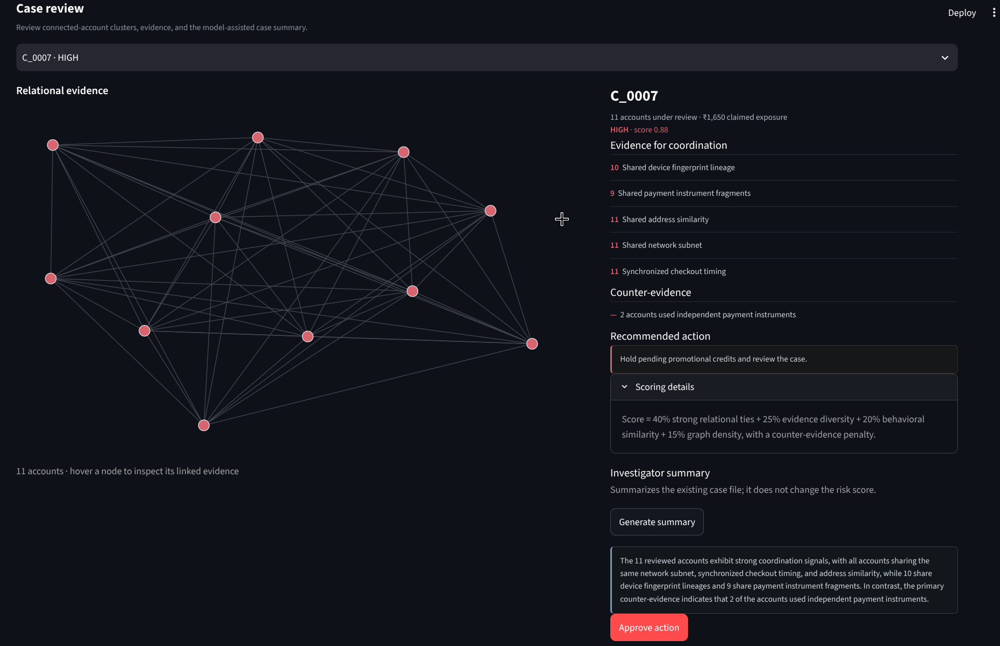

# SybilGraph 
Graph-based detection for coordinated sybil rings (promo abuse, fake accounts, coupon farming) with calibrated precision/recall on a held-out test set.

---

Promo-abuse rings don't look like fraud at the account level. Each account has a plausible name, a plausible order, a plausible device. The signal is **relational**: many accounts sharing devices, payment fragments, IP subnets, and address hashes, created and checking out in synchronized bursts.

Flat rule-based checks (block IP, block device) either miss coordinated rings that rotate identifiers, or over-block legitimate shared environments (hostels, offices, families on one network). SybilGraph is built to separate the two.

## What it does

1. Builds a bipartite graph of accounts ↔ shared attributes (device fingerprint, payment instrument, address hash, IP subnet).
2. Projects it into an account-to-account graph, weighted by attribute type and reinforced with behavioral similarity (session timing patterns, z-scored).
3. Runs Louvain community detection to surface clusters.
4. Scores each cluster on evidence strength, edge density, and behavioral similarity — then **discounts the score** using counter-evidence (independent payment instruments, aged legitimate order history) so genuine shared-network cases aren't punished.
5. Classifies clusters into LOW / MEDIUM / HIGH confidence against thresholds calibrated on a separate seed, generates a case file per cluster, and routes clusters within ±0.05 of the decision boundary to a manual review queue instead of auto-classifying them.
6. Summarises case file via the AI(descriptive only).

## Results (held-out evaluation)

At the calibrated medium-risk operating point:

| Metric | Value |
|---|---|
| Medium threshold | 0.252 |
| Precision | 87.0% |
| Recall | 100.0% |

Example flagged case (`C_0012`, HIGH confidence, score 0.91):

| Evidence type | Accounts affected (of 15) |
|---|---|
| Shared device fingerprint lineage | 14 |
| Shared payment instrument fragments | 13 |
| Shared address similarity | 15 |
| Shared network subnet | 15 |
| Synchronized checkout timing | 15 |
| Counter-evidence: independent payment instrument | 2 |

Claimed exposure: ₹2,250. Recommended action: hold pending promotional credits, pending review.

Borderline clusters (e.g. `C_0003` at 0.77, `C_0005` at 0.29, `C_0000` at 0.26 — each within ±0.05 of a decision boundary) are routed to manual review instead of being auto-classified.

## Screenshots

`Investigation` — cluster graph, evidence breakdown, counter-evidence, recommended action, on-demand AI summary:



## Project structure

```
.
├── app.py
├── src/
│   └── sybilgraph_core.py       # Data generation, graph construction, clustering, scoring, calibration
├── ui/
│   ├── data.py                  # Cached pipeline runs + summary call
│   ├── graphs.py                # Network figure builder
│   ├── components.py            # Reusable UI fragments (evidence list, risk badge, section headers)
│   ├── styles.py                # CSS
│   └── views/
│       ├── investigation.py     # Case review tab
│       ├── replay.py            # Cluster formation time-lapse tab
│       └── evaluation.py        # Precision-recall / metrics tab
└── requirements.txt
```

## Evaluation methodology

- Synthetic dataset: background population + 8 coordinated rings (8–16 accounts each, shared identifiers, synchronized timing) + 5 "noisy legit lookalike" clusters (shared IP/address but independent behavior — models hostels/offices) to stress-test false positives.
- Thresholds are calibrated once on a separate data generation seed and frozen before evaluation runs on the reporting seed, avoiding train/test leakage on the same data.
- Metrics reported are precision, recall, and net exposure prevented net of false-hold cost, on the held-out seed.

## Limitations

- Detection runs on synthetic data modeled on realistic abuse patterns; it has not been validated against production traffic.   